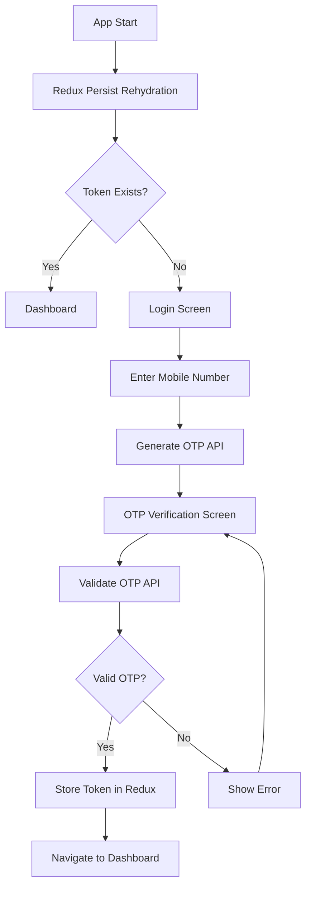

# Document Management System (DMS) - React Native App

A comprehensive mobile application built with React Native that allows users to manage documents effectively with features like upload, tagging, searching, preview, and download capabilities.

## 🚀 Features

### Authentication ✅

- **OTP-Based Login**: Secure login using mobile number and OTP verification
- **Real-time Input Validation**: Progressive form validation with immediate feedback
- **Smart Error Handling**: Touch-based error display with specific error messages
- **Input Filtering**: Automatic filtering of invalid characters (numeric-only input)
- **Token-based Authentication**: JWT token storage for authenticated requests
- **Session Management**: Persistent login state with Redux Persist
- **Auto Rehydration**: Automatic state restoration on app restart

### Document Management 🔄

- **Upload Documents**: Upload files with metadata and tags
- **Search & Filter**: Advanced search functionality with multiple criteria
- **Preview Documents**: In-app document preview
- **Download Documents**: Download files to device
- **Tag Management**: Organize documents with custom tags

## 📁 Project Structure

```
src/
├── components/         # Reusable UI components
├── hooks/             # Custom React hooks
│   ├── redux.ts       # Typed Redux hooks
│   └── useApi.ts      # React Query API hooks
├── screens/           # Application screens
│   ├── LoginScreen.tsx
│   ├── OTPVerificationScreen.tsx
│   └── DashboardScreen.tsx
├── services/          # API and business logic
│   ├── api.ts         # API service with endpoints
│   └── auth.ts        # Authentication service
├── store/             # Redux store configuration
│   ├── index.ts       # Store setup with persist
│   └── slices/        # Redux slices
│       └── authSlice.ts
├── navigation/        # Navigation configuration
│   └── Navigation.tsx
├── types/            # TypeScript type definitions
│   ├── global.d.ts   # Global type definitions
│   ├── types.ts      # Additional types
│   └── index.ts      # Type exports
└── utils/            # Helper functions and utilities
    └── auth.ts       # Authentication utilities
```

## 🛠️ Technology Stack

- **React Native**: 0.81.1 - Mobile app framework
- **TypeScript**: Type-safe development
- **React Navigation**: 7.1.17 - Screen navigation
- **React Query**: 5.87.4 - Server state management and caching
- **Redux Toolkit**: 2.4.0 - Client state management
- **Redux Persist**: 6.0.0 - State persistence
- **Axios**: 1.11.0 - HTTP client for API calls

## 🏗️ Architecture Overview

### State Management Strategy

1. **Redux Toolkit**: Handles authentication state (token, user data, login status)
2. **Redux Persist**: Persists authentication state across app restarts
3. **React Query**: Manages all API calls, caching, and server state

### Benefits of This Architecture

- **Separation of Concerns**: Redux for client state, React Query for server state
- **Better Performance**: React Query's intelligent caching reduces network requests
- **Offline Support**: Redux Persist ensures auth state survives app restarts
- **Type Safety**: Full TypeScript support throughout the app
- **Developer Experience**: Built-in dev tools for debugging

## 📡 API Integration

### Base Configuration

```typescript
const API_BASE_URL = 'https://apis.allsoft.co/api/documentManagement';
```

### Available Hooks

#### Authentication

- `useGenerateOTP()` - Generate OTP for mobile number
- `useValidateOTP()` - Validate OTP and authenticate

#### Document Management

- `useUploadDocument()` - Upload documents with metadata
- `useSearchDocuments()` - Search documents with filters
- `useDocumentTags()` - Fetch available tags (with caching)

### API Service Features

- **Automatic Token Injection**: Tokens added to headers automatically
- **Error Handling**: Centralized error processing
- **Request/Response Interceptors**: For logging and error handling
- **TypeScript Support**: Fully typed requests and responses

## 🔐 Authentication Flow



## 🔧 Setup & Installation

### Prerequisites

- Node.js >= 20
- React Native development environment setup
- Android Studio (for Android development)
- Xcode (for iOS development)

### Installation Steps

1. **Clone the repository**

   ```bash
   git clone <repository-url>
   cd DMSApp
   ```

2. **Install dependencies**

   ```bash
   yarn install
   ```

3. **iOS Setup** (macOS only)

   ```bash
   cd ios && pod install && cd ..
   ```

4. **Run the application**

   For Android:

   ```bash
   yarn android
   ```

   For iOS:

   ```bash
   yarn ios
   ```

5. **Start Metro bundler** (if not started automatically)
   ```bash
   yarn start
   ```

## 📱 API Endpoints

The app connects to the following API endpoints:

### Authentication

- **Generate OTP**: `POST /generateOTP`
- **Validate OTP**: `POST /validateOTP`

### Document Management

- **Upload Document**: `POST /saveDocumentEntry`
- **Search Documents**: `POST /searchDocumentEntry`
- **Get Document Tags**: `POST /documentTags`

## 🔐 Authentication Flow

1. **Login Screen**: User enters mobile number
2. **OTP Generation**: System sends OTP to mobile number
3. **OTP Verification**: User enters received OTP
4. **Token Storage**: Upon successful verification, token is stored
5. **Dashboard Access**: User can access protected features

## 💾 Data Storage

- **Authentication Token**: Stored securely in AsyncStorage
- **User Data**: Mobile number and session info stored locally
- **Session Persistence**: Automatic login on app restart if token exists

## 🎨 UI/UX Features

- **Responsive Design**: Optimized for various screen sizes
- **Loading States**: Visual feedback during API calls
- **Error Handling**: User-friendly error messages
- **Input Validation**: Real-time form validation
- **Timer Display**: Countdown timer for OTP resend

## 🔄 State Management

Currently using React's built-in state management:

- **useState**: Component-level state
- **useEffect**: Side effects and lifecycle management
- **AsyncStorage**: Persistent storage

## 📋 Development Guidelines

### Code Structure

- Follow TypeScript best practices
- Use functional components with hooks
- Implement proper error handling
- Add type definitions for all interfaces

### Styling

- Use StyleSheet.create for performance
- Follow consistent naming conventions
- Implement responsive design principles
- Use semantic color schemes

### API Integration

- Centralized API service in `services/api.ts`
- Consistent error handling across all endpoints
- Request/response type definitions
- Authentication token injection

## 🚧 Future Enhancements

### Phase 1 - Core Features

- [ ] Document upload screen with file picker
- [ ] Document list with search and filter
- [ ] Document preview functionality
- [ ] Tag management system

### Phase 2 - Advanced Features

- [ ] Offline support with local database
- [ ] Push notifications
- [ ] Advanced search with OCR
- [ ] Document sharing capabilities
- [ ] User profile management

### Phase 3 - Enterprise Features

- [ ] Role-based access control
- [ ] Audit logging
- [ ] Advanced analytics
- [ ] Integration with cloud storage

## 🐛 Known Issues

- AsyncStorage warnings (to be resolved with React Native upgrade)
- Some React Navigation deprecation warnings

## 📞 Support

For technical support or feature requests, please contact the development team.

## 📄 License

This project is proprietary and confidential.
